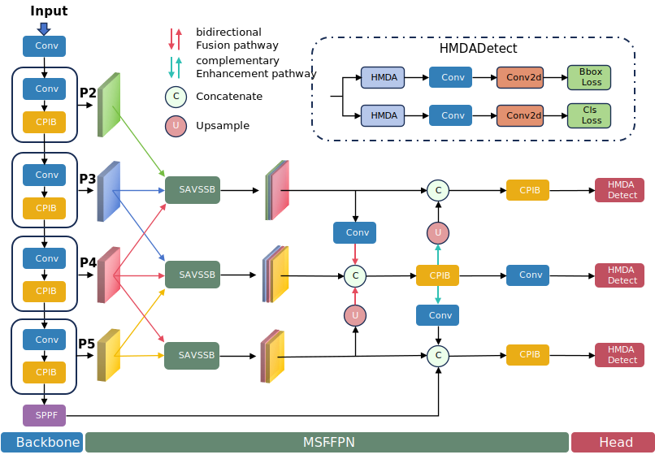

# MedMamba-YOLO: A Vision State Space Model for Medical Image Detection [BIBM 2025]
---
<div align="center">
  
</div>


## Getting Started
---
### 1. Installation
MedMamba-YOLO is developed and tested under:
Python == 3.10
PyTorch == 2.1.0
CUDA == 12.1

### 2. Install Dependencies
```bash
pip install seaborn thop timm einops
cd selective_scan && pip install . && cd ..
pip install -r requirements.txt
```

### 3.Training 
```bash
python train.py
```
### 4.Evaluation
```bash
python val.py
```

## Acknowledgement
---
This repo is modified from open source real-time object detection codebase Ultralytics and is inspired by Mamba YOLO.